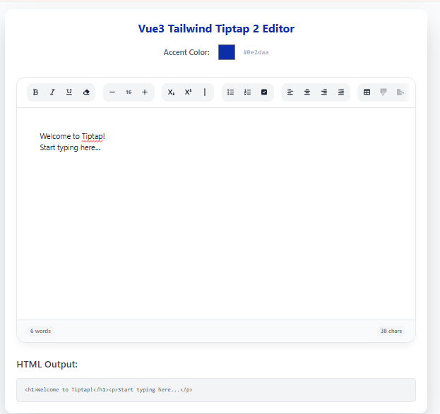

# ProseVue Tiptap 2 Editor (TypeScript) 🚀

**ProseVue Tiptap 2 Editor** – A professional, **high-performance WYSIWYG editor** built with **headless Tiptap v2**, **Tailwind 4**, and **strictly typed with TypeScript**. It combines a premium glassmorphic UI with advanced features typically found in high-end editors like Notion or Google Docs.


[**Live Demo ⚡**](https://prose-vue-tiptap-editor.vercel.app/) | [**JavaScript Version (Legacy) 🔗**](https://github.com/Joshualeexy/proseVue-tiptap-editor)

---

### 📸 Editor Preview


---

## ✨ Elite Features

### 🎨 Design & Experience
- **Sticky Glassmorphic Toolbar**: A beautifully grouped, blurred toolbar that stays with you.
- **Full Dark Mode Support**: Automatically adapts to system theme or manual `.dark` classes.
- **Micro-Interactions**: Tactile button responses (scaling and shadow lifts) for a premium feel.
- **Premium Popovers**: Custom inline input cards for Links, Images, and YouTube (Zero browser prompts).
- **Dynamic Theming**: Change the `accentColor` prop to instantly re-theme the entire editor.

### 🛠️ Advanced Tools
- **Tables 2.0**: Full table support with resizable columns and dynamic row/column management.
- **YouTube Embeds**: Responsive video insertion with shadow and rounded corners.
- **Floating & Bubble Menus**: Contextual tools that appear when you select text or start a new line.
- **Scientific Formatting**: Native support for **Subscript**, **Superscript**, and **Custom Font Sizes**.
- **Typography Engine**: Auto-smart characters (e.g., `(tm)` to ™, `->` to →, `1/2` to ½).
- **Task Lists**: Interactive checkboxes for project management.
- **Alignment & Formatting**: Full text alignment (Left, Center, Right, Justify) and a "Clear Styles" tool.
- **Dual-Format Output**: Native support for both **HTML** and **JSON** (ProseMirror) structured data.

---

## ⚡ Zero-Config Standalone Integration
This editor is designed to be **100% standalone**. You don't need to install a heavy library or deal with complex build steps. 

1. **Copy** `TipTapEditor.vue` into your project.
2. **Install** the dependencies.
3. **Register** your icons.
4. **Done.** It's that simple.

---

## 🚀 Installation & Setup

### 1. Install Tiptap & FontAwesome
Run this command in your project root to get all the power of Tiptap v2:

```bash
npm install @tiptap/vue-3 @tiptap/starter-kit @tiptap/extension-underline @tiptap/extension-bubble-menu @tiptap/extension-floating-menu @tiptap/extension-task-list @tiptap/extension-task-item @tiptap/extension-table @tiptap/extension-table-row @tiptap/extension-table-cell @tiptap/extension-table-header @tiptap/extension-youtube @tiptap/extension-subscript @tiptap/extension-superscript @tiptap/extension-typography @tiptap/extension-highlight @tiptap/extension-text-align @tiptap/extension-color @tiptap/extension-text-style @tiptap/extension-link @tiptap/extension-image @tiptap/extension-placeholder @tiptap/extension-character-count @tiptap/extension-horizontal-rule @tiptap/pm @fortawesome/vue-fontawesome @fortawesome/free-solid-svg-icons @fortawesome/fontawesome-svg-core @fortawesome/free-brands-svg-icons
```

### 2. Register Icons
In your `main.ts`:

```typescript
import { library } from "@fortawesome/fontawesome-svg-core";
import { FontAwesomeIcon } from "@fortawesome/vue-fontawesome";
import { fas } from "@fortawesome/free-solid-svg-icons";

library.add(fas);
app.component("font-awesome-icon", FontAwesomeIcon);
```

### 3. Tailwind Configuration
Ensure you have the typography plugin installed:

```bash
npm install -D @tailwindcss/typography
```

---

## 🛠️ Usage

```vue
<script setup lang="ts">
import { ref } from 'vue';
import TipTapEditor from './components/TipTapEditor.vue';
import type { JSONContent } from '@tiptap/core';

const htmlContent = ref('<h1>Hello Masterpiece!</h1>');
const jsonContent = ref<JSONContent | null>(null); // Typed structured data
</script>

<template>
  <div class="p-8 dark:bg-slate-900 min-h-screen transition-colors">
    <TipTapEditor 
      v-model="htmlContent" 
      v-model:json="jsonContent"
      accent-color="#3b82f6" 
      :limit="5000"
      placeholder="Type / for commands..."
    />
  </div>
</template>
```

---

## 🎨 Customization Props

| Prop | Type | Default | Description |
| :--- | :--- | :--- | :--- |
| `modelValue` | `String` | `''` | **v-model** for HTML string output. |
| `json` | `Object` | `null` | **v-model:json** for structured ProseMirror JSON. |
| `accentColor` | `String` | `#3b82f6` | Primary color for UI accents and indicators. |
| `limit` | `Number` | `0` | Character limit (0 disables the progress bar). |
| `placeholder` | `String` | `Write something ...` | Hint text for empty editor. |

---

## 📜 License
MIT - Free to use for personal and commercial projects. Build something beautiful!
